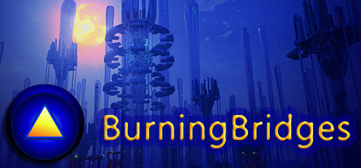
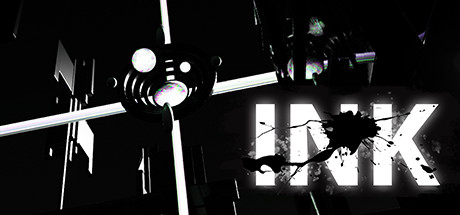
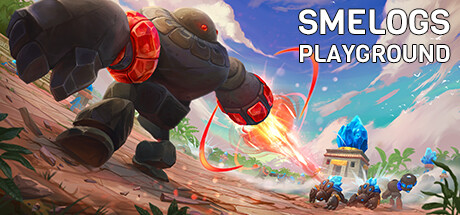
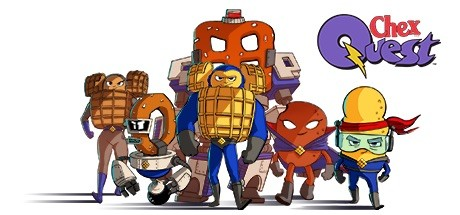
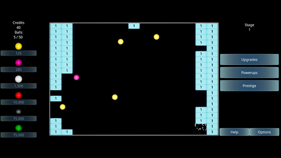
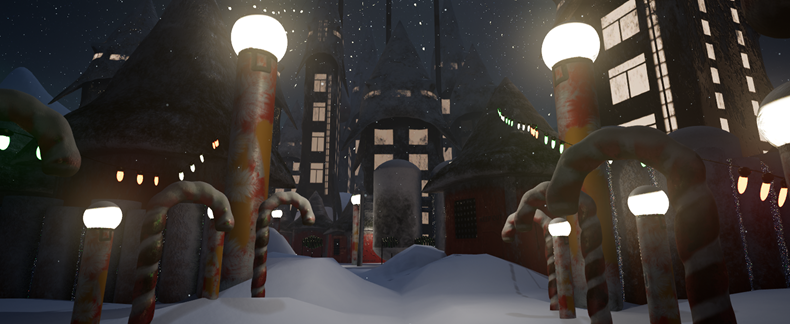

# Portfolio

## Burning Bridges VR

<https://store.steampowered.com/app/818430/BurningBridges_VR/>

- Player character
- Interaction logic
- Subtitles
- User interface
- Animations

## INK

<https://store.steampowered.com/app/1156950/INK/>

- Player character
- Transition effects
- Particle effects
- Game logic
- Animation

## Smelogs Playground

<https://store.steampowered.com/app/1799530/Smelogs_Playground/>

- Pathfinding
- Gameplay ability system integration

## Chex Quest HD

<https://store.steampowered.com/app/804270/Chex_Quest_HD/>

- Player character
- Environmental interactions

## Idle Breaker

<https://jinc.itch.io/idle-breaker>

## Whiteout

<https://amstaddigital.itch.io/white-out>

- Player character
- Enemy AI
- Weapon system
- Wave spawning
- Animated sequences
